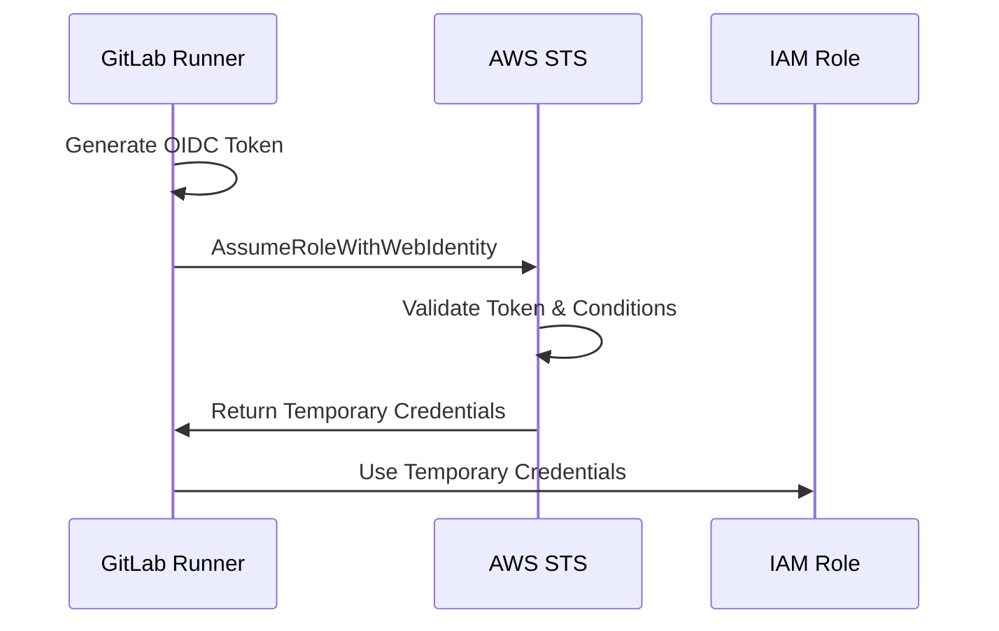

# GitLab CI/CD OIDC Authentication Setup Guide

## 📋 개요 (Overview)

이 가이드는 GitLab CI/CD에서 AWS 리소스에 접근할 때 기존의 액세스 키 기반 인증 대신 OIDC(OpenID Connect) 토큰 기반 인증을 사용하도록 설정하는 방법을 설명합니다.

This guide explains how to configure OpenID Connect (OIDC) token-based authentication for AWS resources in GitLab CI/CD, replacing traditional access key-based authentication.

## 🔐 보안 이점 (Security Benefits)

### OIDC 방식의 장점
- ✅ **단기 토큰**: 자동으로 만료되는 임시 자격 증명 사용
- ✅ **액세스 키 불요**: 정적 AWS 액세스 키 저장/관리 불필요  
- ✅ **세밀한 권한 제어**: 특정 브랜치, 프로젝트, 환경에 대한 조건부 접근
- ✅ **감사 추적성**: 모든 인증 요청이 AWS CloudTrail에 기록
- ✅ **키 순환 불요**: 정적 키 순환 관리 부담 제거

### 기존 방식의 문제점
- ❌ **장기 자격 증명**: 액세스 키가 무기한 유효
- ❌ **키 관리 부담**: 정기적인 키 순환 필요
- ❌ **유출 위험**: GitLab 변수에 저장된 정적 키 유출 가능성
- ❌ **권한 추적 어려움**: 어떤 파이프라인이 어떤 권한을 사용했는지 추적 복잡

## 🏗️ AWS IAM 설정 (AWS IAM Setup)

### 1. OIDC Identity Provider 생성

AWS IAM 콘솔에서 OIDC Identity Provider를 생성합니다:

```bash
# AWS CLI를 사용한 OIDC Provider 생성
aws iam create-open-id-connect-provider \
  --url https://gitlab.com \
  --thumbprint-list 7e04de896a3e666532b60b8c2b6a0f15d2e2e8e6e4a4e4a4e4a4e4a4e4a4e4a4 \
  --client-id-list sts.amazonaws.com
```

### 2. IAM Role 생성 및 Trust Policy 설정

CodeDeploy 및 관련 리소스에 접근할 수 있는 IAM Role을 생성합니다:

```json
{
  "Version": "2012-10-17",
  "Statement": [
    {
      "Effect": "Allow",
      "Principal": {
        "Federated": "arn:aws:iam::YOUR_ACCOUNT_ID:oidc-provider/gitlab.com"
      },
      "Action": "sts:AssumeRoleWithWebIdentity",
      "Condition": {
        "StringEquals": {
          "gitlab.com:aud": "sts.amazonaws.com"
        },
        "StringLike": {
          "gitlab.com:sub": "project_path:YOUR_GITLAB_GROUP/YOUR_PROJECT:ref_type:branch:ref:main"
        }
      }
    }
  ]
}
```

### 3. IAM Role Permissions Policy

Role에 필요한 최소 권한을 부여합니다:

```json
{
  "Version": "2012-10-17",
  "Statement": [
    {
      "Sid": "AllowCodeDeployOperations",
      "Effect": "Allow",
      "Action": [
        "codedeploy:CreateDeployment",
        "codedeploy:GetDeployment",
        "codedeploy:GetDeploymentConfig",
        "codedeploy:RegisterApplicationRevision",
        "codedeploy:ListDeployments",
        "codedeploy:StopDeployment",
        "codedeploy:GetApplication",
        "codedeploy:GetApplicationRevision",
        "codedeploy:ListApplicationRevisions"
      ],
      "Resource": [
        "arn:aws:codedeploy:*:*:application/bluegreen-deployment-production-app",
        "arn:aws:codedeploy:*:*:deploymentgroup/bluegreen-deployment-production-app/*",
        "arn:aws:codedeploy:*:*:deployment/*"
      ]
    },
    {
      "Sid": "AllowS3ArtifactAccess",
      "Effect": "Allow",
      "Action": [
        "s3:PutObject",
        "s3:GetObject",
        "s3:ListBucket"
      ],
      "Resource": [
        "arn:aws:s3:::bluegreen-codedeploy-artifacts",
        "arn:aws:s3:::bluegreen-codedeploy-artifacts/*"
      ]
    },
    {
      "Sid": "AllowALBManagement",
      "Effect": "Allow",
      "Action": [
        "elasticloadbalancing:DescribeTargetGroups",
        "elasticloadbalancing:DescribeTargetHealth",
        "elasticloadbalancing:DescribeListeners",
        "elasticloadbalancing:DescribeLoadBalancers",
        "elasticloadbalancing:ModifyListener"
      ],
      "Resource": [
        "arn:aws:elasticloadbalancing:*:*:loadbalancer/app/bluegreen-deployment-production-alb/*",
        "arn:aws:elasticloadbalancing:*:*:targetgroup/bluegreen-deployment-production-*/*",
        "arn:aws:elasticloadbalancing:*:*:listener/app/bluegreen-deployment-production-alb/*"
      ]
    },
    {
      "Sid": "AllowWaitOperations",
      "Effect": "Allow",
      "Action": [
        "codedeploy:GetDeploymentTarget",
        "codedeploy:ListDeploymentTargets"
      ],
      "Resource": "*"
    }
  ]
}
```

## ⚙️ GitLab 프로젝트 설정 (GitLab Project Setup)

### 1. GitLab CI/CD Variables 설정

GitLab 프로젝트의 **Settings > CI/CD > Variables**에서 다음 변수들을 추가합니다:

| Variable Name | Value | Type | Protected | Masked | Environment |
|---------------|-------|------|-----------|---------|-------------|
| `AWS_ROLE_ARN` | `arn:aws:iam::YOUR_ACCOUNT_ID:role/GitLab-OIDC-Role` | Variable | ✅ | ❌ | All |
| `AWS_DEFAULT_REGION` | `us-east-1` | Variable | ❌ | ❌ | All |
| `BLUE_TARGET_GROUP` | `bluegreen-deployment-production-blue-tg` | Variable | ❌ | ❌ | All |
| `GREEN_TARGET_GROUP` | `bluegreen-deployment-production-green-tg` | Variable | ❌ | ❌ | All |
| `ALB_LISTENER_ARN` | `arn:aws:elasticloadbalancing:...` | Variable | ✅ | ❌ | All |
| `ALB_DNS_NAME` | `your-alb-dns-name.us-east-1.elb.amazonaws.com` | Variable | ❌ | ❌ | All |

### 2. OIDC Token 설정 확인

GitLab 프로젝트에서 OIDC 토큰이 활성화되어 있는지 확인합니다:

- GitLab.com의 경우: 기본적으로 활성화됨
- Self-managed GitLab: GitLab 15.7+ 버전에서 지원

## 🔍 OIDC 인증 흐름 (OIDC Authentication Flow)

### 1. 토큰 발급 과정


### 2. 파이프라인에서의 인증 과정
1. **토큰 생성**: GitLab이 자동으로 OIDC 토큰 생성
2. **토큰 검증**: AWS STS가 토큰의 유효성 및 조건 검증
3. **임시 자격증명**: 유효한 경우 임시 AWS 자격증명 발급
4. **리소스 접근**: 임시 자격증명으로 AWS 리소스 접근

## 🧪 테스트 및 검증 (Testing & Validation)

### 1. OIDC 인증 테스트 파이프라인

간단한 테스트 파이프라인을 실행해 OIDC 인증이 정상 작동하는지 확인:

```yaml
test-oidc-auth:
  stage: test
  image: alpine:latest
  id_tokens:
    GITLAB_OIDC_TOKEN:
      aud: "${AWS_ROLE_ARN}"
  before_script:
    - apk add --no-cache curl jq unzip
    - |
      # AWS CLI 설치
      curl -sL "https://awscli.amazonaws.com/awscli-exe-linux-x86_64.zip" -o "awscliv2.zip"
      unzip -q awscliv2.zip && ./aws/install
      
      # OIDC 토큰으로 인증
      echo "$GITLAB_OIDC_TOKEN" > /tmp/token
      aws sts assume-role-with-web-identity \
        --role-arn "$AWS_ROLE_ARN" \
        --role-session-name "test-session" \
        --web-identity-token file:///tmp/token
  script:
    - aws sts get-caller-identity
    - echo "✅ OIDC authentication successful"
  only:
    - main
```

### 2. 검증 체크리스트

- [ ] AWS OIDC Identity Provider 생성 완료
- [ ] IAM Role 및 Trust Policy 설정 완료  
- [ ] Role에 필요 권한 정책 연결 완료
- [ ] GitLab CI/CD 변수 설정 완료
- [ ] 테스트 파이프라인 성공 확인
- [ ] 기존 AWS 액세스 키 변수 제거 완료

## 🚨 문제해결 (Troubleshooting)

### 자주 발생하는 문제들

#### 1. "AssumeRoleWithWebIdentity" 권한 거부
```bash
# 오류 메시지
An error occurred (AccessDenied) when calling the AssumeRoleWithWebIdentity operation

# 해결 방법
- Trust Policy의 조건문 확인
- gitlab.com:sub 조건이 프로젝트 경로와 정확히 일치하는지 확인
- OIDC Provider의 Thumbprint가 정확한지 확인
```

#### 2. OIDC 토큰 발급 실패
```bash
# 오류 메시지
GITLAB_OIDC_TOKEN is not available

# 해결 방법
- GitLab 버전이 15.7+ 인지 확인
- id_tokens 섹션이 올바르게 설정되었는지 확인
- aud 값이 AWS Role ARN과 일치하는지 확인
```

#### 3. 권한 부족 오류
```bash
# 오류 메시지
User: arn:aws:sts::123456789012:assumed-role/... is not authorized to perform: codedeploy:CreateDeployment

# 해결 방법
- IAM Role의 권한 정책 재검토
- 리소스 ARN이 정확한지 확인
- 필요한 모든 액션이 포함되었는지 확인
```

## 🔄 마이그레이션 체크리스트 (Migration Checklist)

### 구현 순서
1. **[Step 1]** AWS OIDC Identity Provider 생성
2. **[Step 2]** IAM Role 생성 및 Trust Policy 설정
3. **[Step 3]** IAM Role에 필요 권한 연결
4. **[Step 4]** GitLab CI/CD 변수에 AWS_ROLE_ARN 추가
5. **[Step 5]** 파이프라인 업데이트 (OIDC 방식 적용)
6. **[Step 6]** 테스트 실행으로 정상 작동 확인
7. **[Step 7]** 기존 AWS 액세스 키 변수 제거
8. **[Step 8]** 사용하지 않는 IAM 사용자 삭제

### 롤백 준비
OIDC 구현 중 문제 발생 시 기존 액세스 키 방식으로 즉시 롤백할 수 있도록:
- 기존 AWS 액세스 키 변수를 임시로 비활성화만 하고 삭제하지 말 것
- 파이프라인 롤백 버전을 태그로 보관
- 문제 발생 시 빠른 복구를 위한 절차 문서화

## 📚 추가 참고자료 (Additional References)

- [GitLab OIDC 공식 문서](https://docs.gitlab.com/ee/ci/cloud_services/aws/)
- [AWS IAM OIDC Identity Providers](https://docs.aws.amazon.com/IAM/latest/UserGuide/id_roles_providers_create_oidc.html)
- [AWS STS AssumeRoleWithWebIdentity](https://docs.aws.amazon.com/STS/latest/APIReference/API_AssumeRoleWithWebIdentity.html)

---

**보안 알림**: OIDC 구현 완료 후 기존 AWS 액세스 키는 즉시 삭제하여 보안 위험을 제거하세요.